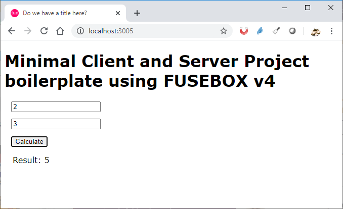
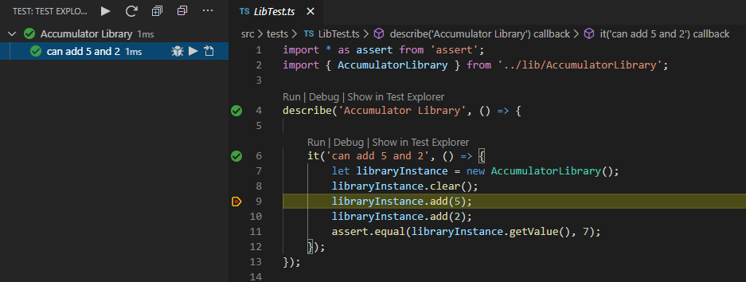

# fusebox-boilerplate

This is a starter boilerblate for fuse-box v4



## Goals

The main aim is to get a fully working development environment in seconds.

By working environment I mean:

Develop a typescript base web application with the following technologies:
   - Web Services written in TypeScript
   - Unit Tests witten in Typescript
   - Web Application written in TypeScript
   - Automatic recompilation using the super fast fusebox bundler.
   - Automatic web page refresh
   - Automatic web services restart
   - Easy install, download the source or git clone it, type `npm install` and the installation is done.
   - Written in and for VSCode. Open the folder in vscode, press F5 and you see your app.
   - debugger works within typescript code for all client code, server code and test code. 
   - VS Code problems watcher displays errors for all client code, server code and test code. 
   - structured folders architecture 
## Quick Run through
### Pre-requisite
Install node.
### Install
From the command line. Assuming your app is called `myapp`
```
git clone https://github.com/paganaye/fusebox-boilerplate.git myapp
cd myapp
npm install
```


### Run
Launch `visual studio code`
```
code .
```
Press `F5`

This should start the www server, the api server, run the tests in watch mode, and launch Chrome and your app should show.
Then you can change any file and it all refreshes automatically.
> we are not there yet though.


## More info
### Folder Structure
```
├───.vscode
├───documentation
├───node_modules
├───src
│   ├───api
│   ├───client
│   ├───lib
│   ├───scripts
│   └───tests
└───www
    ├───build
    ├───css
    ├───fonts
    ├───img
    └───js    
```

# Mocha Test Explorer
To debug the tests you can use the recommended "Mocha Test Explorer" vs code extension.
It will show your test on the left side bar. And also let you start them from within the source itself.
On the picture below we show that the debugger works well.



# Who does that

This repository was written by myself: Pascal GANAYE.

I am not nchanged and not affiliated to fuse-box.

# Questions
Feel free to ask for question or suggest pull requests on github.

